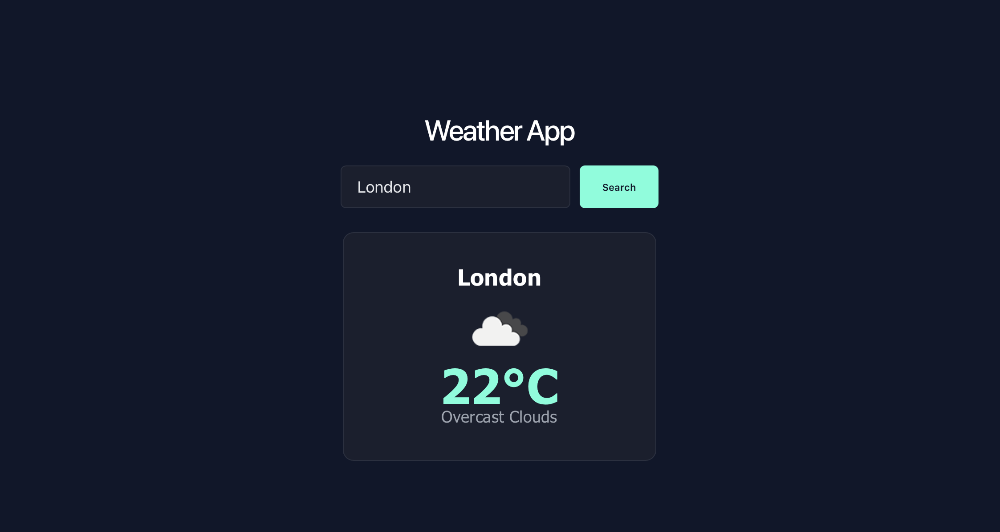

# 🌤️ Weather App

A responsive weather app built with React that lets users search any city and instantly see current conditions, temperature, and a weather icon. Built while learning React fundamentals and API integration.

---

## 🚀 Live Demo

https://weather-app-murex-theta-87.vercel.app

---

## 📸 Preview



---

## ✨ Features

- 🔍 Search weather by city name
- 🌡️ Displays current temperature, condition, and weather icon
- ⏳ Loading and error states for a smooth user experience
- 🔐 API key kept secure using environment variables
- 📱 Fully responsive design

---

## 🛠️ Built With

- React (Vite)
- JavaScript (ES6+)
- CSS3
- [OpenWeatherMap API](https://openweathermap.org/api)

---

## 📂 Project Structure

```text
weather-app/
│
├── src/
│   ├── WeatherApp.jsx
│   ├── weather-app.css
│   ├── App.jsx
│   └── main.jsx
├── .env (not committed)
├── .gitignore
├── package.json
└── README.md
```

---

## 🚀 Future Improvements

- 📍 Auto-detect user's location on load
- 🌡️ Toggle between Celsius and Fahrenheit
- 📅 5-day forecast view
- 💨 Additional details like humidity, wind speed, and "feels like" temperature
- 🌙 Dark/Light mode toggle

---

## 👨‍💻 Author

Made with ❤️ by Habeeb Ishola

GitHub: https://github.com/hoishola

---

## 📄 License

This project is open source and available under the MIT License.